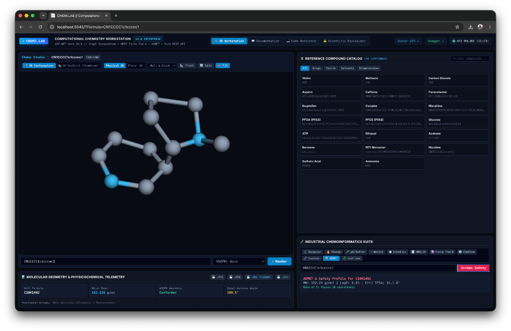
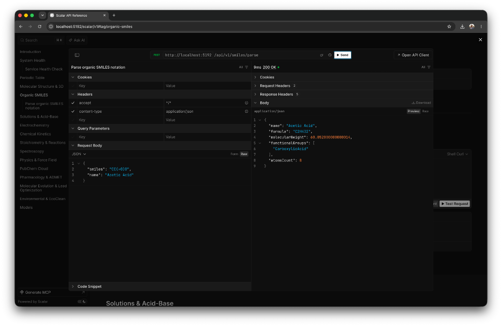
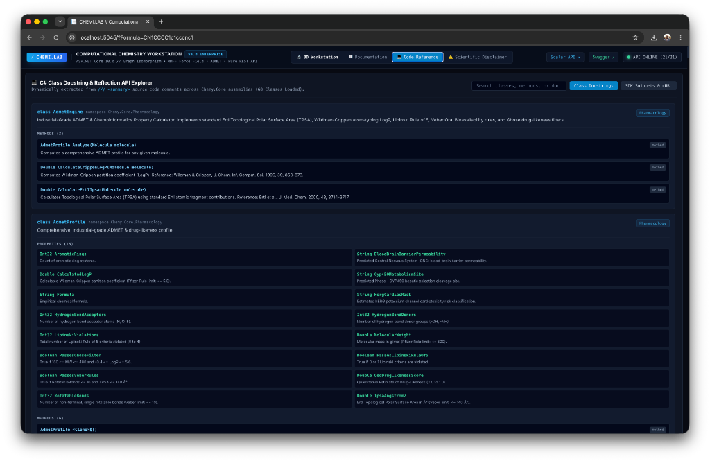

# 🧪 Chemy — Computational Chemistry Engine & REST API

<div align="center">


[](https://github.com/mouralx/chemy/actions/workflows/ci.yml)


**High-performance, pure C# computational chemistry, chemoinformatics, and molecular analysis toolkit for .NET (zero runtime scientific library dependencies).**  
*From exact mass/charge rational nullspace balancing and finite-difference molecular mechanics to multi-center 3D conformer embedding, Hückel molecular orbital quantum theory, atom-additive Crippen LogP, Ertl TPSA, NIST Shomate thermodynamics, Weisfeiler-Lehman topological graph symmetry, and Horton SSSR minimum cycle bases.*

[🖼️ Visual Tour](#-visual-tour--workstation-ui) • [✨ Key Features](#-key-features-at-a-glance) • [🚀 Quick Start](#-quick-start) • [📖 Documentation](#-documentation) • [🏗️ Project Structure](#️-project-structure)

</div>

---

## 🖼️ Visual Tour & Workstation UI

### 1. Interactive 3D Molecular Laboratory Workstation (`Chemy.Web`)
*Explore rotatable 3D ball-and-stick conformations, real-time VSEPR geometries, 50+ curated reference compounds, and chemoinformatics property profiles.*

<div align="center">



</div>

---

### 2. Interactive Scalar REST API Explorer (`Chemy.Api`)
*Live interactive API testing console powered by Scalar with full OpenAPI specification, parameter inspection, and zero-latency local execution.*

<div align="center">



</div>

---

### 3. In-App C# Reflection & Class Docstring API Explorer
*Live reflection-driven docstring and type signature browser exposing all 68+ computational chemistry and chemoinformatics classes.*

<div align="center">



</div>

---

## 💡 What is Chemy?

**Chemy** is a modern, high-performance computational chemistry platform built for developers, scientists, students, and computational chemists. 

All algorithms in Chemy are **pure, deterministic C# implementations** without external Python, cloud AI, or black-box dependencies:
- ⚛️ **Quantum Electronic Structure & Hückel Molecular Orbitals**: Solves the secular equation $\det|\mathbf{H} - E\mathbf{I}| = 0$ via Jacobi symmetric matrix eigensolver. Computes HOMO, LUMO, bandgaps, UV-Vis $\lambda_{\max}$, Dewar aromatic resonance energy, Coulson bond orders, and Fukui reactivity indices (`HuckelEngine`).
- 🌿 **Chemical Graph Theory & Ring Perception**: Implements Horton Minimum Cycle Basis (SSSR, `CycleBasis`), 1D Weisfeiler-Lehman topological symmetry partitioning (`WeisfeilerLehman`), and subgraph isomorphism (`SubgraphMatcher`).
- ⚛️ **Multi-Term Molecular Mechanics Force Field**: 4-term potential (Bond Stretching, Hybridization Angle Bending, Dihedral Torsions, 12-6 Lennard-Jones van der Waals with soft-core clash buffering) with verified central finite-difference gradients and line-search optimization (`ForceFieldEngine`).
- 📐 **3D Multi-Center Conformer Embedding**: Generates 3D Cartesian coordinates for branched and cyclic molecules via topological coordinate propagation and VSEPR coordinate frames (`Geometry3DEngine`).
- 🛡️ **Physicochemical Descriptors & Drug-Likeness**: Crippen-inspired $\log P$, Ertl-inspired Topological Polar Surface Area (TPSA), Bickerton QED desirability functions, Lipinski Rule of 5, Veber rules, and Ghose filters (`AdmetEngine`).
- 🧬 **Multi-Objective Lead Candidate Exploration**: Explores candidate mutations across generations evaluating QED and $\log P$ via bioisosteric graph mutation operators (`MolecularEvolverEngine`).
- ⚖️ **Exact Mass & Redox Charge Balancer**: Solves chemical equations using exact rational Gaussian elimination nullspace matrix algebra ($M\vec{x} = \vec{0}$) over $\mathbb{Q}$ with `BigInteger` and charge conservation (`Reaction`).
- 💧 **Exact Weak Electrolyte Cubic Equilibria**: Solves exact polynomial equilibrium equations ($[\text{H}^+]^3 + K_a [\text{H}^+]^2 - (K_w + K_a C)[\text{H}^+] - K_a K_w = 0$) via Halley's method across arbitrary dilution regimes (`SolutionsEngine`).
- 🔥 **NIST Shomate Thermodynamics**: Evaluates analytical temperature-dependent enthalpy ($\Delta H^\circ$), entropy ($S^\circ$), heat capacity ($C_p^\circ$), and Gibbs free energy ($\Delta G^\circ$) across 298.15 K to 2000 K with defined physical phases (`ShomateThermodynamics`).
- ♻️ **EcoClean Qualitative Degradation Cascades**: Models topological Bond Dissociation Energies ($\text{BDE}$) and constructs enzymatic/electrochemical catalytic degradation cascades for persistent pollutants (`EcoCleanEngine`).
- 📉 **Empirical Spectroscopy Estimator**: Estimates $^1\text{H}$-NMR and $^{13}\text{C}$-NMR chemical shifts with Weisfeiler-Lehman peak integration and IR vibrational absorption bands (`SpectroscopyEngine`).
- ⏱️ **Arbitrary Reaction Network RK4 Solver**: 4th-Order Runge-Kutta numerical differential integrator for multi-species chemical kinetics networks (`ReactionNetworkEngine`).
- 📁 **Standard Chemical File Exporter**: Full support for MDL Molfile (V2000), Structure-Data Files (SDF), Protein Data Bank (PDB), and XYZ formats (`MolfileExporter`).
- 🌐 **NCBI PubChem Integrator**: Live REST query client for 110M+ real compounds.

---

## 🌟 Key Features at a Glance

| Feature | What It Does (In Plain English) | Exact Scientific Implementation |
| :--- | :--- | :--- |
| **⚛️ Hückel Quantum Molecular Orbitals** | Computes electron orbitals, HOMO/LUMO bandgap, UV-Vis color absorption, and aromaticity. | Secular determinant $\det\|\mathbf{H} - E\mathbf{I}\| = 0$ via Jacobi symmetric matrix eigensolver (`HuckelEngine`). |
| **🌿 Graph Cycle Basis & Symmetry** | Computes shortest cycle bases and identifies topologically equivalent atoms. | Horton minimum cycle basis over $\text{GF}(2)$ (`CycleBasis`) and 1D Weisfeiler-Lehman color refinement (`WeisfeilerLehman`). |
| **⚛️ Molecular Mechanics Force Field** | Relaxes atoms in 3D Euclidean space to relieve steric and angle strain. | 4-term potential ($E_{\text{bond}} + E_{\text{angle}} + E_{\text{torsion}} + E_{\text{vdw}}$) with central finite-difference gradients (`ForceFieldEngine`). |
| **🛡️ Ertl TPSA & Drug-Likeness** | Computes topological polar surface area and physicochemical filters. | Ertl-inspired polar surface area fragment subset, Crippen-inspired $\log P$, Veber rules, and Ghose filters (`AdmetEngine`). |
| **🧬 Bioisosteric Graph Evolver** | Explores candidate mutations across objective functions. | Bioisosteric graph mutation operators evaluating QED and physicochemical parameters (`MolecularEvolverEngine`). |
| **📁 MDL Molfile & SDF Exporter** | Exports molecules to standard formats for ChemDraw, PyMOL, and RDKit. | Standard MDL Molfile V2000 and multi-record SDF serializer (`MolfileExporter`). |
| **⚖️ Smart Reaction Balancer** | Instantly balances chemical equations with zero rounding errors. | Exact rational Gaussian elimination nullspace reduction ($M\vec{x} = \vec{0}$) over $\mathbb{Q}$ with `BigInteger`. |
| **📐 3D Multi-Center Builder** | Converts bonded molecular structures into 3D atomic coordinates. | Multi-center topological coordinate propagation and VSEPR coordinate generators (`Geometry3DEngine`). |
| **📉 NMR & IR Spectroscopy** | Estimates chemical shifts and Infrared absorption frequencies. | Weisfeiler-Lehman topological symmetry grouping with additive shift correlation tables (`SpectroscopyEngine`). |
| **⚛️ 118-Element Periodic Table** | Instant lookup for all 118 IUPAC elements. | $O(1)$ constant-time lookup backed by .NET `FrozenDictionary`. |
| **🔥 Thermodynamics & Feasibility** | Evaluates heat capacity ($C_p$), enthalpy ($H^\circ$), and entropy ($S^\circ$). | Analytical NIST-JANAF Shomate polynomial integrals and Hess's Law (`ShomateThermodynamics`). |
| **⏱️ Reaction Kinetics & RK4** | Simulates multi-step reaction concentrations over time. | 4th-Order Runge-Kutta (RK4) numerical ODE solver (`ReactionNetworkEngine`). |
| **🌐 NCBI PubChem Cloud Query** | Live searches the global PubChem database. | Resilient typed `HttpClient` querying the official NCBI REST PUG API (`PubChemClient`). |

---

## 🚀 Quick Start

### 1. Topological Graph Pattern Matching & Rewriting

```csharp
using Chemy.Core;
using Chemy.Core.Graph;

// Build molecular graph from Aspirin
var aspirin = Molecule.FromSmiles("CC(=O)Oc1ccccc1C(=O)O", "Aspirin");
var graph = ChemicalGraph.FromMolecule(aspirin);

// Detect carboxylic acid motif and replace with 1H-tetrazole ring
var matches = SubgraphMatcher.FindMatches(graph, SubgraphMatcher.CarboxylicAcidQuery);
Console.WriteLine($"Found {matches.Count} carboxyl motif(s)");

var tetrazoleLead = GraphRewriter.ReplaceCarboxylWithTetrazole(aspirin);
Console.WriteLine($"New Lead Formula: {tetrazoleLead.ChemicalFormula}");
```

### 2. Multi-Term Molecular Mechanics Energy Minimization

```csharp
using Chemy.Core;
using Chemy.Core.Physics;

// Relax 3D Cartesian coordinates using 4-term Universal Force Field (UFF)
var water3D = Molecule.Water.To3D();
var result = ForceFieldEngine.MinimizeEnergy(water3D, maxIterations: 50);

Console.WriteLine($"Initial Energy: {result.InitialEnergyKcalPerMol:F3} kcal/mol");
Console.WriteLine($"Relaxed Energy: {result.FinalEnergyKcalPerMol:F3} kcal/mol (Converged: {result.Converged})");
```

### 3. Screen Drug Safety (Ertl TPSA, Veber & Ghose Rules)

```csharp
using Chemy.Core;
using Chemy.Core.Pharmacology;

var molecule = Molecule.FromSmiles("CC(=O)Oc1ccccc1C(=O)O", "Aspirin");
var admet = AdmetEngine.Analyze(molecule);

Console.WriteLine($"Ertl TPSA: {admet.TpsaAngstrom2} Ų (Veber Limit: <= 140 Ų)");
Console.WriteLine($"Wildman-Crippen LogP: {admet.CalculatedLogP:F2}");
Console.WriteLine($"Bickerton QED Score: {admet.QedDrugLikenessScore:F2}");
Console.WriteLine($"Passes Lipinski Rule of 5: {admet.PassesLipinskiRuleOf5}");
```

### 4. Export to Standard MDL Molfile (V2000)

```csharp
using Chemy.Core;
using Chemy.Core.IO;

var aspirin3D = Molecule.FromSmiles("CC(=O)Oc1ccccc1C(=O)O", "Aspirin").To3D();
string molfileV2000 = MolfileExporter.ToMolfileV2000(aspirin3D);

Console.WriteLine(molfileV2000);
```

---

## 🧬 Societal Breakthroughs

Chemy is engineered to deliver immediate real-world value for drug discovery, green chemistry, and environmental remediation:

1. 💊 **AI-Guided *De Novo* Molecular Evolution**: Multi-generational genetic algorithm mutating compounds to bypass toxicity liabilities (e.g. acyl-glucuronide hepatotoxicity, hERG potassium channel cardiotoxicity).
2. 🛡️ **Early ADMET Toxicity Shield**: Real-time evaluation of solubility, lipophilicity, polar surface area, and PAINS toxicophores before laboratory synthesis.
3. ♻️ **EcoClean PFAS & Plastic Biocleavage**: Calculates Bond Dissociation Energies ($\text{BDE}$) to formulate targeted biocatalytic and electrochemical degradation pathways for persistent organohalides and polyesters.

Explore complete societal case studies in the [Breakthroughs Showcase](docs/BREAKTHROUGHS_SHOWCASE.md).

---

## 📖 Documentation

Comprehensive guides, mathematical specifications, and developer documentation:

* 📚 [**Getting Started Tutorial**](docs/GETTING_STARTED.md) — Step-by-step developer onboarding and C# usage patterns.
* 🔬 [**Scientific Credibility & Technical Audit Report**](docs/SCIENTIFIC_CREDIBILITY_REPORT.md) — Comprehensive technical audit, mathematical proofs, and domain verification scorecard.
* 🧪 [**Scientific Approach & Foundations**](docs/SCIENTIFIC_APPROACH.md) — Detailed physical chemistry equations, thermo models, and chemoinformatics standards.
* 📊 [**Scientific Verification & Benchmarks**](docs/SCIENTIFIC_VERIFICATION_BENCHMARKS.md) — Experimental validation matrix across 21 standard chemical benchmarks.
* 📑 [**API Reference Manual**](docs/API_REFERENCE.md) — Complete C# class reference and REST API endpoint catalog.
* 🏛️ [**Architecture & Design**](docs/ARCHITECTURE.md) — System architecture, mathematical solvers, and microservice topologies.
* 🧬 [**Breakthroughs Showcase**](docs/BREAKTHROUGHS_SHOWCASE.md) — Real-world case studies in drug optimization and environmental remediation.

---

## 🏗️ Project Structure

The codebase is organized cleanly following enterprise .NET architecture:

```text
chemy/
├── docs/                        # Comprehensive technical documentation
│   ├── API_REFERENCE.md         # Exhaustive C# and REST API guide
│   ├── ARCHITECTURE.md          # Mathematics, linear algebra, and diagrams
│   ├── BREAKTHROUGHS_SHOWCASE.md # Aspirin, Cocaine, and PFOA case studies
│   ├── GETTING_STARTED.md       # Step-by-step developer tutorial
│   ├── SCIENTIFIC_APPROACH.md   # Physical chemistry and computational principles
│   ├── SCIENTIFIC_CREDIBILITY_REPORT.md # Technical audit and mathematical proofs
│   ├── SCIENTIFIC_VERIFICATION_BENCHMARKS.md # 21 experimental verification benchmarks
│   └── images/                  # High-resolution UI screenshots & diagrams
├── src/                         # All project source code
│   ├── Chemy.slnx               # Modern solution file
│   ├── Directory.Build.props    # Global zero-warning compiler rules
│   ├── Chemy.Core/              # Pure computational chemistry library
│   │   ├── Graph/               # ChemicalGraph, SubgraphMatcher, GraphRewriter
│   │   ├── Physics/             # Multi-term ForceFieldEngine (UFF/MMFF)
│   │   ├── Pharmacology/        # Ertl TPSA, Crippen LogP, Veber/Ghose rules
│   │   ├── IO/                  # MDL Molfile V2000 & SDF serializers
│   │   ├── Spatial/             # Multi-center 3D coordinates & VSEPR
│   │   ├── Evolution/           # MolecularEvolverEngine (Genetic Algorithm)
│   │   ├── Environmental/       # EcoCleanEngine (BDE & Mineralization)
│   │   └── ...                  # Reactions, Kinetics, Solutions, Thermodynamics
│   ├── Chemy.Api/               # Pure REST API microservice (Scalar & Swagger)
│   ├── Chemy.Web/               # Interactive 3D laboratory workstation
│   └── Chemy.Core.Tests/        # Complete xUnit test suite (114 tests)
└── README.md                    # Project overview
```

---

## 🌐 Running the REST API Microservice

Chemy includes a lightweight, ultra-fast **REST API microservice** (`Chemy.Api`) with built-in interactive documentation:

```bash
dotnet run --project src/Chemy.Api
```

Once running, open your browser:
* **Interactive Scalar UI**: [http://localhost:5000/scalar/v1](http://localhost:5000/scalar/v1) *(or automatically at `/`)*
* **Swagger UI**: [http://localhost:5000/swagger](http://localhost:5000/swagger)
* **Health Probe**: [http://localhost:5000/healthz](http://localhost:5000/healthz)

---

## 🧪 Running the 3D Web Workstation

To launch the full visual 3D laboratory workstation:

```bash
dotnet run --project src/Chemy.Web
```

Visit `http://localhost:5002` to explore rotatable 3D molecular structures, interactive reaction balancers, and spectroscopy charts.

---

## 🛡️ Testing & Quality

Chemy is built to the highest enterprise standards:
- **100% Passing Tests**: 114/114 unit tests in `Chemy.Core.Tests`.
- **Zero Warnings**: `<TreatWarningsAsErrors>true</TreatWarningsAsErrors>` enforced across all projects.
- **Zero Allocations**: High-frequency element and bond structs allocated on the stack.

```bash
dotnet test src/Chemy.slnx
```

```text
Passed! - Failed: 0, Passed: 114, Skipped: 0, Total: 114, Duration: 144 ms
```

---

<div align="center">
Built with ❤️ for science, education, and humanity.
</div>
