# Chemy Architecture & Mathematical Foundations

This document provides a comprehensive breakdown of the internal architectural patterns, domain object graph hierarchy, computational algorithms, and observability models implemented in **Chemy**.

---

## 📑 Architecture Overview

```mermaid
graph TD
    subgraph Core["Chemy.Core (Pure Domain & Algorithmic Engines)"]
        Graph["ChemicalGraph (Adjacency Lists & DFS Rings)"]
        Matcher["SubgraphMatcher (VF2 Isomorphism)"]
        Rewriter["GraphRewriter (Topological Transformations)"]
        ForceField["Multi-Term Molecular Mechanics Force Field (MMFF/UFF)"]
        ADMET["Standard ADMET (Ertl TPSA, Crippen LogP, Veber Rules)"]
        Molfile["MolfileExporter (MDL Molfile V2000 & SDF)"]
        Elements["Elements (FrozenDictionary, O(1))"]
        Parsing["Formula & SMILES Parsers"]
        Spatial["3D Spatial & VSEPR Engine"]
        Evolver["Bioisosteric Lead Optimization Engine"]
        EcoClean["EcoClean PFAS/Plastic Pathways Engine"]
        Spec["Spectroscopy Correlation Engine (NMR/IR)"]
        Cloud["PubChem Live REST Client"]
        Kinetics["Kinetics & RK4 Network Engine"]
        Stoich["Exact Rational Balancer (MatrixSolver)"]
        Thermo["Thermodynamics & Benson Additivity Engine"]
    end

    subgraph API["Chemy.Api (Pure REST Microservice)"]
        Scalar["Interactive Scalar API Reference (/scalar/v1)"]
        Swagger["OpenAPI v3 / Swagger UI (/swagger)"]
        Logging["ILogger Structured Logging Pipeline"]
        HealthChecks["Health Probes (/healthz)"]
        CorsMiddleware["CORS Middleware"]
    end

    subgraph Web["Chemy.Web (Razor Laboratory Workstation Client)"]
        Viewport["WebGL 3Dmol.js Viewport (2.2x Scale)"]
        Telemetry["Molecular Characteristics Card"]
        Catalog["50-Compound Database Grid"]
        Suite["Computational Chemistry & Analytical Suite"]
    end

    Core --> API
    API --> Web
```

---

## 1. Topological Chemical Graph Theory (`ChemicalGraph.cs`)

`ChemicalGraph` models molecules as an immutable mathematical graph $G = (V, E)$:
- **Vertices ($V$)**: Represent atoms with elemental identity $Z$, formal charge $q$, and implicit hydrogen counts.
- **Edges ($E$)**: Represent covalent, ionic, and aromatic bonds with formal bond orders ($1, 2, 3, 1.5$).
- **Cycle Detection (`CycleBasis.cs`)**: Employs Horton's polynomial-time Minimum Cycle Basis algorithm over $\text{GF}(2)$ to compute the authentic Smallest Set of Smallest Rings (SSSR) and Frèrejacque cyclomatic ring number ($M = E - V + C$).
- **Subgraph Isomorphism (`SubgraphMatcher.cs`)**: Implements an injective backtracking VF2-style subgraph matching algorithm to locate target functional groups.
- **Graph Rewriting (`GraphRewriter.cs`)**: Performs atomic node substitution, bond reconnection, and ring fusion directly on graph structures.

---

## 2. Multi-Term Molecular Mechanics Force Field (`ForceFieldEngine.cs`)

`ForceFieldEngine` calculates a 4-term analytical potential energy function:

$$E_{\text{total}} = E_{\text{bond}} + E_{\text{angle}} + E_{\text{torsion}} + E_{\text{vdw}}$$

### 1. Covalent Bond Stretching Potential (Harmonic)
$$E_{\text{bond}} = \sum_{bonds} \frac{1}{2} k_r (r_{ij} - r_0)^2$$

### 2. Valence Angle Bending Potential (Harmonic)
$$E_{\text{angle}} = \sum_{angles} \frac{1}{2} k_\theta (\theta_{ijk} - \theta_0)^2$$

### 3. Dihedral Torsional Strain
$$E_{\text{torsion}} = \sum_{dihedrals} \frac{V_n}{2} [1 + \cos(n\phi - \gamma)]$$

### 4. Non-Bonded Steric van der Waals (Lennard-Jones 12-6)
$$E_{\text{vdw}} = \sum_{i < j, \text{ non-bonded}} \epsilon_{ij} \left[ \left( \frac{r_m}{r_{ij}} \right)^{12} - 2 \left( \frac{r_m}{r_{ij}} \right)^6 \right]$$

### Energy Optimization
Minimization computes spatial analytical force gradients $\vec{F}_i = -\nabla_i E$ and relaxes 3D Cartesian coordinates via **adaptive step-size gradient descent** with convergence threshold $|\Delta E| < 10^{-4}\text{ kcal/mol}$.

---

## 3. Standard Chemoinformatics & ADMET Models (`AdmetEngine.cs`)

1. **Ertl Topological Polar Surface Area (TPSA)**:
   $$\text{TPSA} = \sum_{i \in \{\text{polar atoms O, N, S, P}\}} \Delta S_i$$
   Based on the published 43-fragment Ertl table: Carbonyl $=O$ ($17.07\text{ \AA}^2$), Hydroxyl $-OH$ ($20.23\text{ \AA}^2$), Ester/Ether $-O-$ ($9.23\text{ \AA}^2$), Secondary Amide $-C(=O)NH-$ ($29.10\text{ \AA}^2$), Primary Amide $-C(=O)NH_2$ ($43.09\text{ \AA}^2$), Nitro $-NO_2$ ($45.82\text{ \AA}^2$).
2. **Wildman-Crippen $\log P$ (1999)**:
   $$\log P = \sum_{i} a_i n_i$$
   Summing atomic fragment contributions across 68 structural atom classes (hybridization $sp^3, sp^2, sp$, aromaticity, formal charges, heteroatom neighbor bonding).
3. **Bickerton Quantitative Estimate of Drug-Likeness (QED)**:
   $$\text{QED} = \exp\left( \frac{\sum_{i=1}^8 w_i \ln d_i}{\sum_{i=1}^8 w_i} \right)$$
   using asymmetric sigmoid desirability functions across 8 physicochemical and structural parameters.
4. **Veber Oral Bioavailability Rules**:
   - $\text{Rotatable Bonds} \le 10$
   - $\text{TPSA} \le 140\text{ \AA}^2$
5. **Ghose Drug Filter**:
   - $160 \le \text{Molecular Weight} \le 480\text{ g/mol}$
   - $-0.4 \le \log P \le 5.6$
   - $20 \le \text{Total Atom Count} \le 70$
6. **Lipinski's Rule of 5 (Pfizer Criteria)**:
   - $\text{MW} \le 500\text{ g/mol}$, $\log P \le 5.0$, $\text{HBD} \le 5$, $\text{HBA} \le 10$.

---

## 4. Standard Chemical File Formats (`MolfileExporter.cs`)

Provides compliant serialization for:
- **MDL Molfile V2000**: Includes 3-line header, counts line (`aaabbb... V2000`), 16-column atom Cartesian coordinate block, 7-column bond block (1-indexed), and `M  END` terminator.
- **Structure-Data File (SDF)**: Concatenates multi-record Molfile V2000 entries separated by `$$$$` with data property blocks (`> <FORMULA>`, `> <VSEPR_SHAPE>`).

---

## 5. Chemical Equation Balancing via Exact Rational Linear Algebra

Stoichiometric balancing in `Chemy.Core` solves the matrix equation $M \vec{x} = \vec{0}$ over the field of rational numbers $\mathbb{Q}$:

1. **Matrix Formulation**: For $m$ unique chemical elements across $R$ reactants and $P$ products, an $m \times (R+P)$ matrix $M$ is constructed:
   $$M_{r, c} = \begin{cases} +\text{count}(e_r \text{ in compound } c) & 1 \le c \le R \\ -\text{count}(e_r \text{ in compound } c) & R < c \le R+P \end{cases}$$
2. **Gaussian Elimination & RREF**: Gaussian elimination with partial pivoting reduces $M$ to Reduced Row Echelon Form (RREF) using exact `Rational` GCD reduction, avoiding floating-point rounding errors.
3. **LCM Integer Scaling**: The rational nullspace basis vector is scaled by the Least Common Multiple (LCM) of all denominators to produce the minimal primitive positive integer stoichiometric coefficients $\vec{x} \in \mathbb{Z}_{>0}^{R+P}$.

---

## 6. Runge-Kutta 4th Order (RK4) Reaction Networks

For multi-step consecutive reaction kinetics ($A \xrightarrow{k_1} B \xrightarrow{k_2} C$):

$$\frac{dA}{dt} = -k_1 A, \quad \frac{dB}{dt} = k_1 A - k_2 B, \quad \frac{dC}{dt} = k_2 B$$

`ReactionNetworkEngine` evaluates four gradient slopes per time step $\Delta t$:

$$k_1 = f(t_n, y_n)$$
$$k_2 = f\left(t_n + \frac{\Delta t}{2}, y_n + \frac{\Delta t}{2} k_1\right)$$
$$k_3 = f\left(t_n + \frac{\Delta t}{2}, y_n + \frac{\Delta t}{2} k_2\right)$$
$$k_4 = f(t_n + \Delta t, y_n + \Delta t k_3)$$
$$y_{n+1} = y_n + \frac{\Delta t}{6}(k_1 + 2k_2 + 2k_3 + k_4)$$

---

## 7. Observability, Structured Logging & Health Probes

1. **Structured Logging (`ILogger<T>`)**:
   - `LogInformation`: High-level operations, request entrypoints, and high-level milestones.
   - `LogDebug`: Algorithmic details, calculated constants, and molecular dimensions.
   - `LogWarning`: Input parsing failures and fallback server-side triggers.
   - `LogError`: Unhandled exceptions with full stack traces.
2. **Container Health Probes (`/healthz`)**:
   - Returns standard HTTP 200 OK with timestamp for Kubernetes liveness and readiness probes.
3. **Strict Compiler Policy**:
   - `src/Directory.Build.props` enforces `<TreatWarningsAsErrors>true</TreatWarningsAsErrors>` and `<Nullable>enable</Nullable>`.
